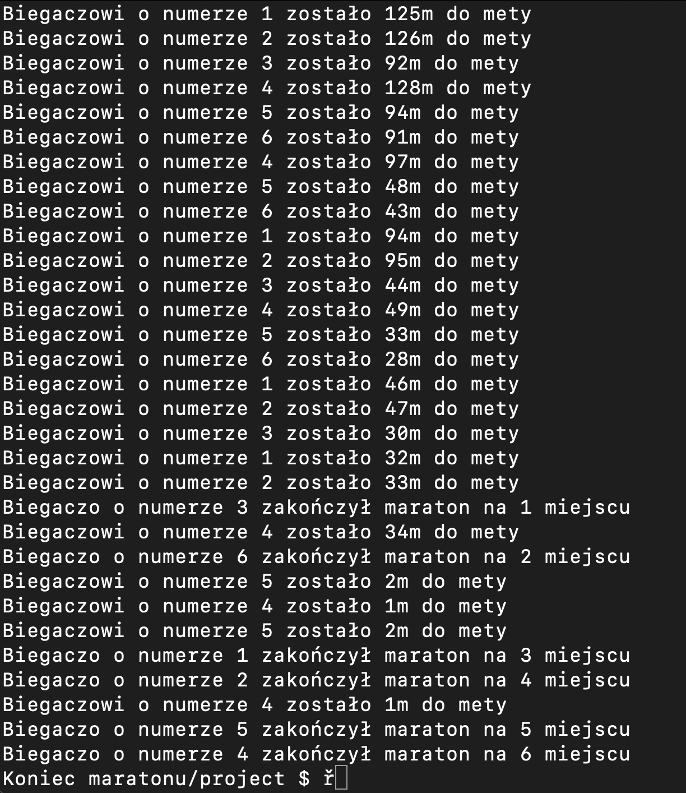

# Programowanie równoległe i rozproszone
lab7

# Jak uruchomić
```
cd c
# Tworzymy kontener oraz wchodzimy w niego
docker run --rm -it -v $(pwd):/project nlknguyen/alpine-mpich
# Kompilacja w kontenerze
mpicc lab7.c -o lab7.exe
# Uruchomienie
mpirun -np 7 ./lab7.exe
```
----
